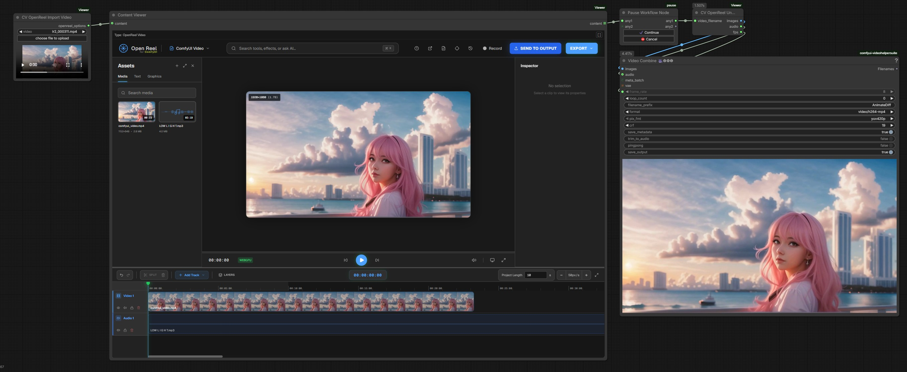
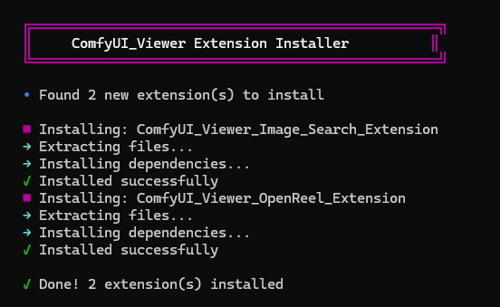

# ComfyUI Viewer - OpenReel Video Extension


Embeds a [modified fork of OpenReel Video](https://github.com/WASasquatch/openreel-video-comfyui) into ComfyUI_Viewer for interactive video editing within ComfyUI workflows.



## Features

- **Feature rich video editor** embedded in ComfyUI with timeline, effects, transitions, and text overlays. ***Work in progress***
- **Seamless integration** with ComfyUI's theme system (dark/light mode sync)
- **Direct workflow integration** import videos, images, and audio — edit in OpenReel, export back to ComfyUI nodes
- **Backend render engine** server-side FFmpeg export for faster rendering without browser limitations
- **Bundle system** combine video, images, and audio from separate workflow branches into a single OpenReel project
- **Standalone mode** launch OpenReel in a new tab for full-screen editing
- **Local processing** video editing and export via browser FFmpeg.wasm or system FFmpeg
- **Keyframe animation** with interactive timeline — drag keyframe diamonds to adjust timing
- **Media management** auto-match re-imported media to placeholders, deterministic naming, delete missing assets
- **Project management** rename projects, import/export project scripts
- **Script import/export** save and load OpenReel project files for reuse across workflows

## Nodes

### CV OpenReel Bundle Video
Bundles IMAGE frames and optional AUDIO from ComfyUI workflows into a video for editing in OpenReel.

**Inputs:**
- `images` (IMAGE, required) — batch of frames from any ComfyUI video generation workflow
- `fps` (FLOAT, required) — frame rate (default 24.0, range 1.0-120.0)
- `audio` (AUDIO, optional) — audio track to include in the video

**Output:** `openreel_options` (STRING) — tagged JSON for ComfyUI_Viewer's `content` input

**Use Case:** Edit videos generated within ComfyUI (e.g., from AnimateDiff, SVD, frame interpolation, etc.)

### CV OpenReel Bundle Images
Bundles IMAGE tensors as individual image files for editing in OpenReel. Unlike Bundle Video, each image becomes a separate clip on the timeline.

**Inputs:**
- `images` (IMAGE, required) — batch of images from any ComfyUI workflow

**Output:** `openreel_options` (STRING) — tagged JSON for ComfyUI_Viewer's `content` input

**Use Case:** Import generated images as individual timeline clips for compositing, slideshows, or mixed-media editing

### CV OpenReel Bundle Audio
Bundles AUDIO from ComfyUI workflows as a WAV file for editing in OpenReel.

**Inputs:**
- `audio` (AUDIO, required) — audio from any ComfyUI audio node

**Output:** `openreel_options` (STRING) — tagged JSON for ComfyUI_Viewer's `content` input

**Use Case:** Import generated or loaded audio as a timeline clip for mixing with video/images

### CV OpenReel Bundle Combine
Combines outputs from multiple Bundle nodes into a single import so OpenReel receives all assets at once.

**Inputs:**
- `bundle_a` (STRING, required) — output from any Bundle node
- `bundle_b` (STRING, optional) — second bundle output
- `bundle_c` (STRING, optional) — third bundle output
- `bundle_d` (STRING, optional) — fourth bundle output

**Output:** `openreel_options` (STRING) — combined tagged JSON for ComfyUI_Viewer's `content` input

**Use Case:** Combine video + images + audio from different workflow branches into one OpenReel project

### CV OpenReel Import Video
Loads an external video file and outputs tagged JSON for the Content Viewer to display in OpenReel.

**Inputs:**
- `video` (COMBO) — video file from ComfyUI's `input/` directory (with upload button)

**Output:** `openreel_options` (STRING) — tagged JSON for ComfyUI_Viewer's `content` input

**Use Case:** Edit existing video files from disk

### CV OpenReel Unpack
Unpacks an edited video exported from OpenReel into IMAGE frames, AUDIO, and fps.

**Inputs:**
- `video_filename` (STRING, force input) — filename from Content Viewer output

**Outputs:**
- `images` (IMAGE) — decoded frames as tensor batch
- `audio` (AUDIO) — extracted audio (or None if no audio track)
- `fps` (FLOAT) — frame rate

## Installation

### Prerequisites

- [ComfyUI](https://github.com/comfyanonymous/ComfyUI) installed
- [ComfyUI Viewer](https://github.com/WASasquatch/ComfyUI_Viewer)  **v0.4.0 or higher** installed

### Install Steps

1. **Download the ZIP from GitHub**


2. **Copy the ZIP to your `ComfyUI/custom_nodes/ComfyUI_Viewer/extensions` folder**
3. **Restart ComfyUI** and the extension will be installed and loaded.




## Workflow Setup

**It's highly recommended to use a pause node** to prevent the workflow from continuing while you edit your video in OpenReel.

We recommend [ComfyUI-pause](https://github.com/wywywywy/ComfyUI-pause)

### Recommended Workflow Structure:

**For External Videos:**
```
[CV OpenReel Import Video] → [Content Viewer] → [Pause Node] → [CV OpenReel Unpack] → [Save Image/Video]
```

**For ComfyUI-Generated Videos:**
```
[Generate Frames] → [CV OpenReel Bundle Video] → [Content Viewer] → [Pause Node] → [CV OpenReel Unpack] → [Save Image/Video]
```

**For Mixed Media (Video + Images + Audio):**
```
[Generate Frames] → [Bundle Video]  ─┐
[Generate Images] → [Bundle Images] ─┤→ [Bundle Combine] → [Content Viewer] → [Pause] → [Unpack]
[Load Audio]      → [Bundle Audio]  ─┘
```

### How the Pause Workflow Works:

1. **First Run ("Edit Run")**: The workflow runs and pauses at the Pause node
   - Your video loads into OpenReel editor in the Content Viewer
   - The workflow is suspended, giving you time to edit
   - Edit your video (trim, effects, transitions, text, etc.)
   - Click **SEND TO OUTPUT** when finished editing

2. **Second Run ("Export Run")**: Cancel the workflow and run it again
   - Click **Cancel** button (do NOT click "Continue")
   - Run the workflow again
   - Your edited video will be unpacked and passed to downstream nodes
   - The output is ready for Save Image or further processing

**Important**: If you click "Continue" instead of "Cancel", the original input video will be passed through, not your edited version.

## Workflow Examples

### Workflow 1: Edit External Video Files
1. Add `CV OpenReel Import Video` node and select a video file
2. Connect its output to `WAS ComfyUI Viewer` → `content` input
3. Add a **Pause node** after Content Viewer
4. Add `CV OpenReel Unpack` node after the Pause node
5. Connect Content Viewer's output to CV OpenReel Unpack's `video_filename` input
6. **First run**: Workflow pauses, edit your video in OpenReel, click **SEND TO OUTPUT**
7. **Cancel workflow** and run again — edited video is unpacked as IMAGE/AUDIO/fps

### Workflow 2: Edit ComfyUI-Generated Videos
1. Generate frames using any ComfyUI workflow (AnimateDiff, SVD, frame interpolation, etc.)
2. Add `CV OpenReel Bundle Video` node
3. Connect IMAGE output → `images` input, set `fps`, optionally connect AUDIO
4. Connect Bundle node output to `WAS ComfyUI Viewer` → `content` input
5. Add a **Pause node** after Content Viewer
6. Add `CV OpenReel Unpack` node after the Pause node
7. Connect Content Viewer's output to CV OpenReel Unpack's `video_filename` input
8. **First run**: Workflow pauses, edit in OpenReel, click **SEND TO OUTPUT**
9. **Cancel workflow** and run again — edited frames/audio ready for further processing

### Advanced Usage
- **Launch in new tab**: Click the external link icon in embedded mode to open OpenReel in a standalone tab for full-screen editing
- **Theme sync**: OpenReel automatically matches ComfyUI's theme (dark/light mode)
- **Persistent exports**: Once exported, the video persists in the workflow until you export a new one or change the input video
- **Backend render**: Use the backend render option in the export menu for server-side FFmpeg encoding (faster, no browser memory limits)
- **Script import/export**: Save your OpenReel project as a script file and re-import it in other workflows

## Known Issues

### Firefox Hard Refresh Bug
**Issue**: In Firefox, performing a hard refresh (Ctrl+Shift+R / Cmd+Shift+R) may cause the OpenReel iframe to enter a reload loop.

**Workaround**: Use a **soft refresh** (Ctrl+R / Cmd+R or F5) instead. This issue does not occur in Chrome/Edge.

**Technical Details**: Use Chrome! Firefox's aggressive cache invalidation on hard refresh causes module loading failures in the iframe context. This is a browser-specific behavior and does not affect normal workflow usage.

## Architecture

This extension demonstrates ComfyUI_Viewer's `/app` functionality for embedding full web applications:

- **Frontend**: Modified OpenReel React app served from `/was/openreel_video/app/`
  - Built app included in `apps/openreel_app/` (~3.7 MB)
  - Source code: [openreel-video-comfyui](https://github.com/WASasquatch/openreel-video-comfyui) (fork with ComfyUI integration)
- **Backend**: Python nodes handle video I/O, session management, and server-side FFmpeg rendering
- **Communication**: PostMessage API for iframe ↔ ComfyUI communication
- **Parser**: Custom parser (`openreel_video_parser.py`) handles input/output data flow

### Repository Structure

- **Extension repository** (this repo): Complete package with Python nodes, built app, and integration code (~4 MB)
- **App source repository** ([openreel-video-comfyui](https://github.com/WASasquatch/openreel-video-comfyui)): React app source code for contributors who want to modify the app (~7 MB source)

The built app is included directly in this repository for convenience. If you want to modify the OpenReel app itself, see the source repository.

See ComfyUI_Viewer's README for details on creating your own viewer extensions with embedded apps.

## License

MIT — see [LICENSE](LICENSE)
